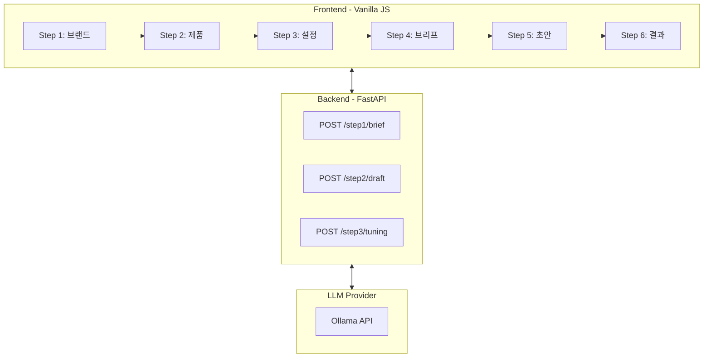
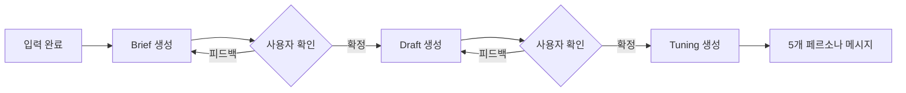
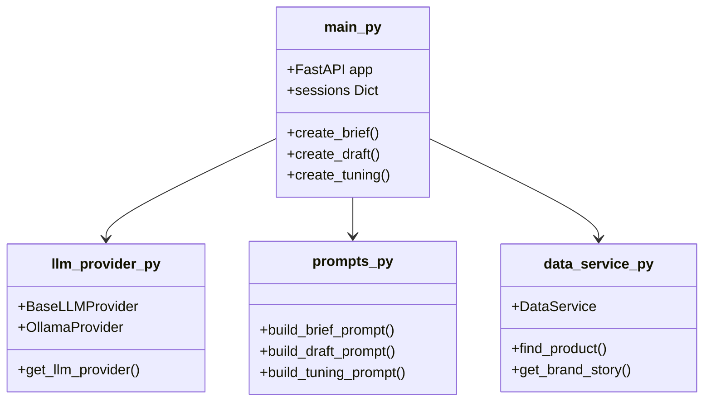
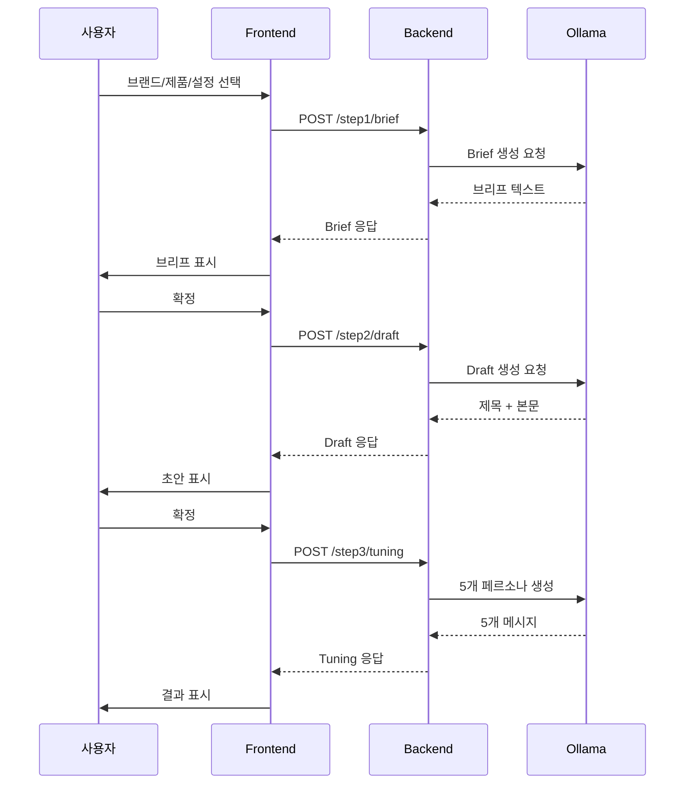

# Frontend & Backend Architecture

> CRM Message Studio - 3단계 인터랙티브 AI 파이프라인

---

## 🎯 개요

CRM Message Studio는 뷰티 브랜드를 위한 **AI 기반 CRM 메시지 생성 도구**입니다.

### 핵심 기능

| 기능                          | 설명                                      |
| ----------------------------- | ----------------------------------------- |
| **3단계 AI 파이프라인** | Brief → Draft → Tuning 순차 생성        |
| **인터랙티브 피드백**   | 각 단계에서 수정 요청 및 재생성 가능      |
| **5개 페르소나 최적화** | Luxury, Budget, Sensitive, Trend, Natural |
| **실시간 LLM 연동**     | Ollama API (교체 용이한 Provider 패턴)    |

---

## 🏗 시스템 아키텍처



---

## 🔄 3단계 AI 파이프라인



### 각 단계 설명

| 단계                     | 역할                      | 출력 형식               |
| ------------------------ | ------------------------- | ----------------------- |
| **Step 4: Brief**  | 마케팅 개조식 브리프 생성 | 타겟/핵심메시지/USP/CTA |
| **Step 5: Draft**  | 브랜드 톤 반영 초안       | 제목 + 본문             |
| **Step 6: Tuning** | 페르소나별 최적화         | 5개 맞춤 메시지         |

---

## 📁 폴더 구조

```
AmoRe_crm_generator/
├── backend/                    # FastAPI 백엔드
│   ├── main.py                 # 앱 엔트리 + 6개 API 엔드포인트
│   ├── config.py               # 환경변수 로드 (.env)
│   ├── llm_provider.py         # LLM Provider 추상화 (Ollama)
│   ├── schemas.py              # Pydantic 요청/응답 모델
│   ├── data_service.py         # JSON 데이터 로딩 + 캐싱
│   └── prompts.py              # 3단계 프롬프트 템플릿
│
├── frontend/                   # Vanilla JS 프론트엔드
│   ├── index.html              # 6단계 위저드 UI
│   ├── script.js               # 앱 로직 + AI 파이프라인 연동
│   ├── api.js                  # 백엔드 API 통신 모듈
│   ├── style.css               # Toss 스타일 디자인 시스템
│   └── brand_images.json       # 브랜드 로고/색상 정보
│
├── data/                       # JSON 데이터셋
│   ├── products.json           # 제품 정보 (6.5MB)
│   ├── brand_stories.json      # 브랜드 스토리/톤
│   ├── personas.json           # 5개 페르소나 정의
│   ├── crm_goals.json          # AARRR 스테이지별 목표
│   └── campaign_events.json    # 캠페인 이벤트
│
├── .env                        # 환경변수 (OLLAMA_* 설정)
└── .env.example                # 환경변수 예시
```

---

## 🔧 백엔드 컴포넌트



### 주요 파일 설명

| 파일                | 역할                                  |
| ------------------- | ------------------------------------- |
| `main.py`         | FastAPI 앱, 6개 엔드포인트, 세션 관리 |
| `llm_provider.py` | Ollama API 호출, Provider 교체 용이   |
| `prompts.py`      | Brief/Draft/Tuning 프롬프트 템플릿    |
| `data_service.py` | products.json 등 데이터 로드 및 캐싱  |
| `schemas.py`      | Pydantic 요청/응답 스키마 정의        |

---

## 📡 API 명세

**Base URL**: `http://localhost:8000/api/v1`

### Step 1: Brief

| Method   | Endpoint                | 설명               |
| -------- | ----------------------- | ------------------ |
| `POST` | `/step1/brief`        | 마케팅 브리프 생성 |
| `PUT`  | `/step1/brief/refine` | 피드백 반영 재생성 |

### Step 2: Draft

| Method   | Endpoint                | 설명                     |
| -------- | ----------------------- | ------------------------ |
| `POST` | `/step2/draft`        | 브랜드 톤 반영 초안 생성 |
| `PUT`  | `/step2/draft/refine` | 피드백 반영 재생성       |

### Step 3: Tuning

| Method   | Endpoint                 | 설명                       |
| -------- | ------------------------ | -------------------------- |
| `POST` | `/step3/tuning`        | 5개 페르소나별 메시지 생성 |
| `PUT`  | `/step3/tuning/refine` | 특정 페르소나 재생성       |

---

## 🖥 프론트엔드 흐름



---

## 📖 사용 가이드

### 간편 모드 vs 전문가 모드

| 모드                  | 설명                              |
| --------------------- | --------------------------------- |
| **간편 모드**   | 기존 브랜드/제품 목록에서 선택    |
| **전문가 모드** | 커스텀 브랜드/제품 정보 입력 가능 |

### 6단계 워크플로우

1. **브랜드 선택** - CRM 메시지 발송 브랜드
2. **제품 선택** - 추천할 제품
3. **설정** - 발송 목적 (AARRR) + 스타일
4. **📋 브리프 확인** - AI 생성 브리프 검토/수정
5. **✍️ 초안 확인** - 브랜드 톤 반영 메시지 검토
6. **🎉 결과** - 5개 페르소나별 최종 메시지

### 피드백 및 재생성

각 AI 단계에서:

- ✅ "다음" 클릭 → 확정 후 다음 단계
- 🔄 피드백 입력 후 "재생성" → 수정된 결과 생성

---

## 🚀 실행 방법

```bash
s# 1. 의존성 설치
pip install -r requirements.txt

# 2. 환경변수 설정
cp .env.example .env
# .env 파일에서 OLLAMA_* 값 수정

# 3. 백엔드 실행 (포트 8000)
python -m uvicorn backend.main:app --port 8000 --reload

# 4. 프론트엔드 실행 (포트 8888)
python3 -m http.server 8888

# 5. 브라우저 접속
open http://localhost:8888/frontend/index.html

# 포트 8000만 종료
lsof -ti:8000 | xargs kill -9

# 포트 8888만 종료
lsof -ti:8888 | xargs kill -9
```

---

## 🔄 LLM Provider 교체

`backend/llm_provider.py`에서 Provider 교체 가능:

```python
# 현재: Ollama
llm = get_llm_provider("ollama")

# 향후: OpenAI, Claude 등
# llm = get_llm_provider("openai")


```
